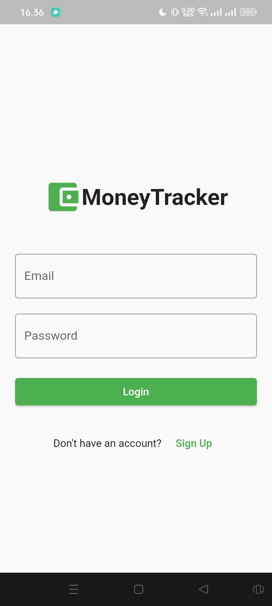
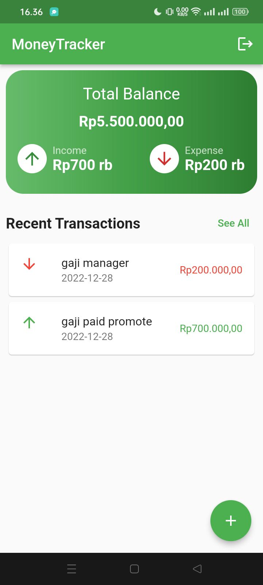
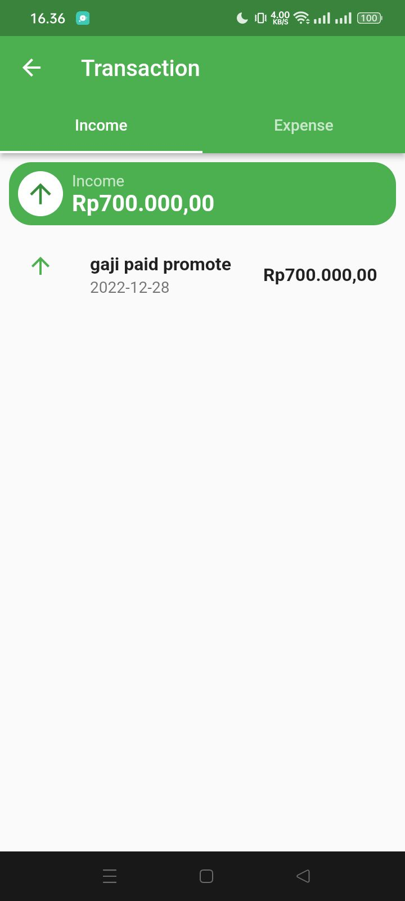
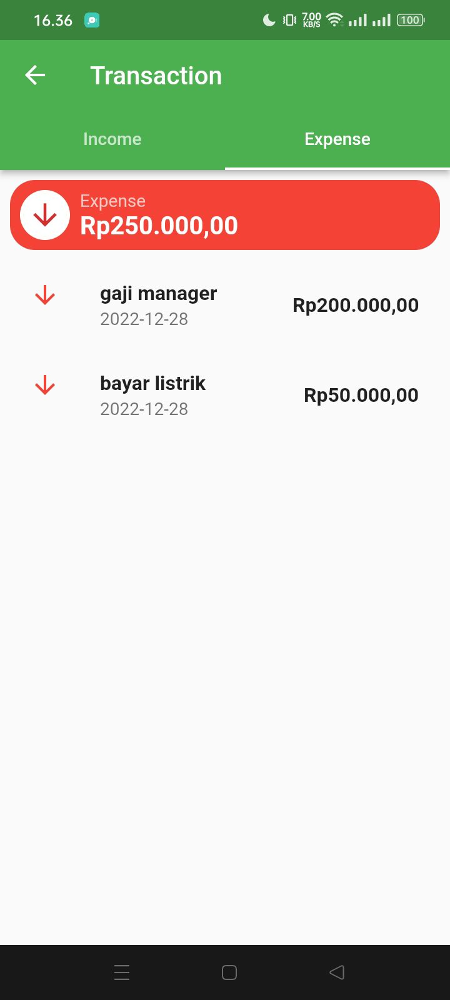

# Money Tracker App

A new Flutter project.

# Our Team

 

 
   
    [Teknik Informatika](http://if.uinsgd.ac.id/) [UIN Sunan Gunung Djati Bandung](https://uinsgd.ac.id/) 

## Latar Belakang
Masih banyak orang yang sulit mengontrol keuangan dengan baik. Tanpa pencatatan yang tepat, sulit bagi seseorang untuk mengetahui dengan tepat berapa banyak uang yang masuk dan keluar, sehingga sulit untuk mengelola keuangan dengan baik. Beberapa masalah yang ada adalah sebagai berikut :

1. Kurangnya pengawasan atas keuangan : Tanpa pencatatan yang tepat, sulit bagi seseorang untuk mengetahui dengan tepat berapa banyak uang yang masuk dan keluar, sehingga sulit untuk mengelola keuangan dengan baik.
2. Kesulitan mengatur anggaran : Tanpa pencatatan yang tepat, sulit bagi seseorang untuk mengatur anggaran dengan efektif. 
3. Kebutuhan untuk menghemat uang : Orang sulit mengedintifikasi kebiasaan keuangan yang tidak efisien dan membuat perubahan yang diperlukan untuk menghemat uang.
4. Kesulitan mengelola keuangan bisnis : Bagi para pelaku bisnis, mengelola keuangan bisnis dapat menjadi tugas yang rumit

## Solusi Yang Ditawarkan
Kami menawarkan solusi dengan membuat aplikasi pencatatan keuangan berbasis mobile yang kami beri nama **Money Tracker**. 

Aplikasi ini dibuat dengan tujuan untuk membantu pengguna mengelola keuangan pribadi atau bisnis mereka dengan lebih baik. Berikut ini adalah beberapa manfaat dari aplikasi **Money Tracker** :
1. Membantu mengelola pengeluaran : Dengan mencatat setiap pengeluaran yang Anda lakukan, Anda dapat memahami dengan lebih baik bagaimana uang Anda terpakai dan mengambil tindakan yang diperlukan untuk mengelola pengeluaran dengan lebih baik.
2. Membantu mengelola anggaran : Aplikasi pencatatan keuangan dapat membantu Anda mengelola anggaran dengan menentukan batas pengeluaran untuk setiap kategori pengeluaran dan memonitor bagaimana Anda terus berada di jalur yang telah Anda tetapkan.
3. Menyediakan laporan keuangan : Aplikasi pencatatan keuangan dapat menyediakan laporan keuangan yang terperinci, termasuk laporan pemasukan, pengeluaran, dan sisa uang. Ini dapat membantu Anda memahami keuangan Anda dengan lebih baik dan membuat keputusan keuangan yang tepat.
4. Membantu mengelola keuangan secara mobile : Aplikasi pencatatan keuangan dapat diakses dari perangkat seluler, sehingga Anda dapat mengelola keuangan Anda kapan saja dan dimana saja.

## Target Market
Pasar untuk aplikasi kami ini sangat luas dan terdiri dari individu, keluarga, dan bisnis kecil yang mencari cara untuk mengelola keuangan dengan lebih baik.

Adapula kriteria individu yang cocok dengan aplikasi **Money Tracker** ini antara lain :
1. Memiliki kebutuhan keuangan yang sederhana : Aplikasi **Money Tracker** ini mungkin cocok bagi individu yang memiliki kebutuhan keuangan yang sederhana dan tidak memiliki banyak aktiva atau hutang.
2. Ingin mengelola keuangan denga lebih baik : Aplikasi **Money Tracker** ini dapat membantu individu yang ingin mengelola keuangan dengan lebih baik dengan mencatat pemasukan dan pengeluaran, membuat anggaran, dan menyediakan laporan keuangan.
3. Memiliki mobilitas tinggi : Aplikasi **Money Tracker** dapat diakses dari perangkat seluler, sehingga cocok bagi individu yang sering berpergian atau tidak memiliki akses ke komputer tetap.
4. Tidak memiliki dana darurat yang cukup : Aplikasi **Money Tracker** dapat membantu individu yang tidak memiliki dana darurat yang cukup dengan memberi tahu mereka tentang semua tagihan dan kewajiban bulanan. Ini dapat membantu individu tersebut membuat keputusan yang tepat dan mengelola keuangan dengan lebih baik.

## Tampilan Aplikasi Money Tracker

  

  

## [Link Aplikasi](https://play.google.com/store/apps/details?id=com.group4ifc.moneytracker)

## [Link Video Demo](https://youtu.be/40AJmVES71s)

## [Link Pitch Deck]()
